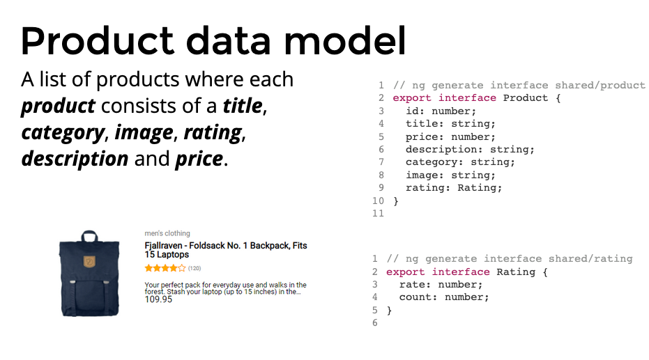
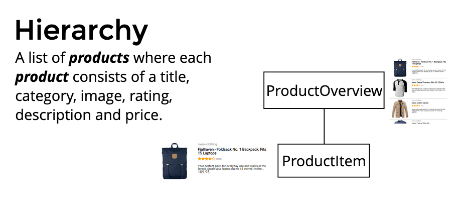
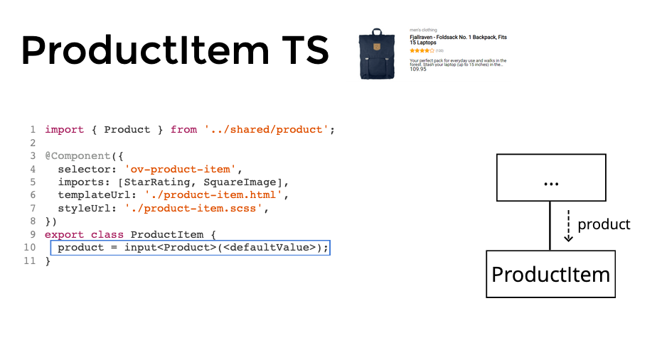
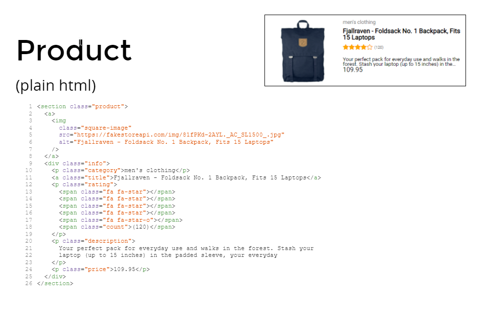

# Assignment 1 Components

## 1.1 Setting up a data model



- Generate a product interface:

```
npx ng g i shared/product
```

- Generate a rating interface:

```
npx ng g i shared/rating
```

- Implement the interfaces

_References to other files can be auto-imported by your IDE by pressing ctrl + space (VSCode + Intellij)._

Resources:
- [ng generate](https://angular.dev/cli/generate)

## 1.2 Setting up components



Generate components:

```
npx ng g c ProductsOverview
npx ng g c ProductItem
```

In `app.component.html` replace all html with:

```html
<ov-products-overview></ov-products-overview>
```

You should see:
```
products works!
```

- Add the following product to `products-overview.ts` and make sure it's typed correctly

```typescript
{
    id: 1,
    title: 'Fjallraven - Foldsack No. 1 Backpack, Fits 15 Laptops',
    price: 109.95,
    description:
      'Your perfect pack for everyday use and walks in the forest. Stash your laptop (up to 15 inches) in the padded sleeve, your everyday',
    category: "men's clothing",
    image: 'https://fakestoreapi.com/img/81fPKd-2AYL._AC_SL1500_t.png',
    rating: {
      rate: 3.9,
      count: 120,
    },
  }
```

_To quickly see the value of `product` on screen use a `Pipe` called `json` in `products.component.html`:_

```html
{{ product | json }}
```

Resources:
- [JSON Pipe](https://angular.io/api/common/JsonPipe)



- Configure `ProductItem` so it accepts an `Input` called `product` of type `Product`.

Resources:
- [Input guide](https://angular.dev/guide/components/inputs)



- Paste the following html in `product-item.html`:

```html
<section class="product">
  <a>
    
  </a>
  <div class="info">
    <p class="category">men's clothing</p>
    <a class="title">Fjallraven - Foldsack No. 1 Backpack, Fits 15 Laptops</a>
    <p class="rating">
      <span class="fa fa-star star"></span>
      <span class="fa fa-star star"></span>
      <span class="fa fa-star star"></span>
      <span class="fa fa-star star"></span>
      <span class="fa fa-star-o star"></span>
      <span class="count">(120)</span>
    </p>
    <p class="description">
      Your perfect pack for everyday use and walks in the forest. Stash your
      laptop (up to 15 inches) in the padded sleeve, your everyday
    </p>
    <p class="price">109.95</p>
  </div>
</section>
```

Before we fix the template, we should render `ProductItem` and make sure it receives a product.

- Update `ProductsOverview`'s template so it binds a product to a `ProductItem`.

- Update the template of `ProductItem` so there are no hardcoded values (except for the rating).

Resources:
- [Interpolation](https://angular.dev/guide/templates/binding#render-dynamic-text-with-text-interpolation)

You should have a working page with one product on screen.

## 1.3 More components


- Generate a component for Rating and SquareImage
```
npx ng g c SquareImage
npx ng g c StarRating
```

- Move the square image html to the `SquareImage` component, make sure it supports `[src]` + `[alt]` inputs
 and use it in the `ProductItem` component.

- Move the hardcoded rating html to the `StarRating` component and use it in the `ProductItem` component.

## 1.4 List of products


- Refactor the `ProductsOverview` component so it holds a collection of `Product[]` instead of a single one.

- Add the following product to the collection so you have 2 products in total.

```typescript
{
  id: 2,
  title: 'Mens Casual Premium Slim Fit T-Shirts ',
  price: 22.3,
  description:
    'Slim-fitting style, contrast raglan long sleeve, three-button henley placket, light weight & soft fabric for breathable and comfortable wearing. And Solid stitched shirts with round neck made for durability and a great fit for casual fashion wear and diehard baseball fans. The Henley style round neckline includes a three-button placket.',
  category: "men's clothing",
  image:
    'https://fakestoreapi.com/img/71-3HjGNDUL._AC_SY879._SX._UX._SY._UY_t.png',
  rating: {
    rate: 4.1,
    count: 259,
  },
},
```


- Render a list of products by using `@for` block in combination with `<ov-product-item>`, use the following template:

```html
<ul class="products">
  <li>
    <ov-product-item></ov-product-item>
  </li>
</ul>
```

- Render the amount of stars in the `StarRating` component using `@for` and `@if`

Resources:
- [Control flow blocks @if, @for, @switch explained](https://angular.dev/guide/templates/control-flow)
- [*ngFor in-depth (deprecated)](https://blog.angular-university.io/angular-2-ngfor/)

You should see 2 different products on screen.

## 1.5 View encapsulation
Currently all styling is globally registered in `src/styles.scss`.

- Move all component specific css to the styles of the components.

Your `styles.scss` file should look like:

```scss
/* You can add global styles to this file, and also import other style files */

/* CSS Reset */

// ...

body {
  font-family: "Roboto", sans-serif;
}
```

Resources:
- [ViewEncapsulation](https://angular.dev/guide/components/styling)
- [Guide on ViewEncapsulation with examples](https://angular.io/guide/view-encapsulation)

Your app should still render correctly.

[Solution](https://github.com/OpenValue-D/angular-basic-training/compare/main...assignment-1-solution)